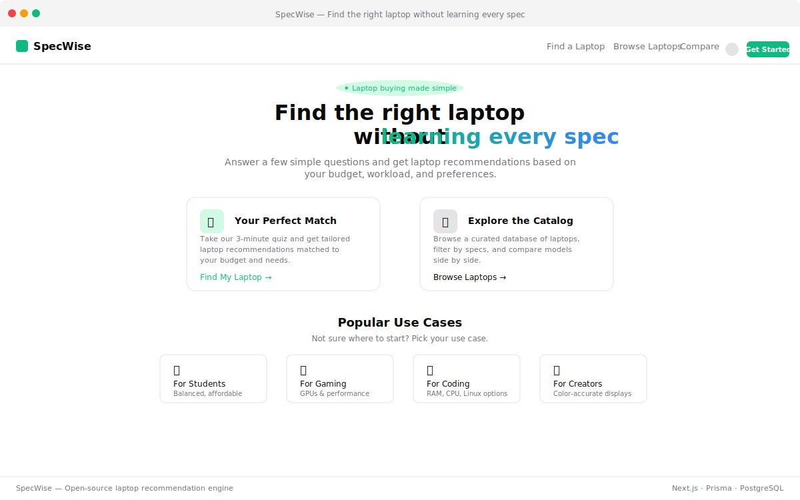

**SpecWise** translates plain-English questions into weighted F-score rankings across 50+ laptop spec fields. Answer a quick quiz, get a match — no hardware terminology required.

Built with Next.js 16, Prisma 7, PostgreSQL, TypeScript.

---

## Features

| Path | What it does |
|---|---|
| `/quiz` | Quick (8) or advanced (18) questions — region-aware budget, saved progress |
| `/results` | Top match hero + alternatives grid with scores, reasoning, trade-offs |
| `/compare?ids=...` | Side-by-side comparison across 12 spec categories |
| `/laptops` | Debounced catalog search with live filtering |
| `/laptops/[id]` | Full spec breakdown + retailer pricing |
| `/category/[useCase]` | Pre-filtered for 10 use cases — no quiz needed |
| `/admin` | Manage catalog listings, filter by region (secured via `ADMIN_API_KEY`) |
| **Global** | Region-aware pricing (6 regions), dark/light mode, auto region detection |

---

## Quick start

```bash
git clone https://github.com/Goku-py/SpecWise
cd specwise
npm install
```

Copy `.env.example` to `.env`. Only `DATABASE_URL` is required.

```bash
npx prisma migrate deploy
npx tsx prisma/seed.ts
npm run dev
```

Open [http://localhost:3000](http://localhost:3000).

---

## Stack

| Layer | |
|---|---|
| Framework | Next.js 16 (App Router) |
| UI | React 19, Tailwind CSS 4, Lucide icons, DM Sans |
| Language | TypeScript 5 |
| Database | PostgreSQL (Neon / pg) |
| ORM | Prisma 7 |
| Validation | Zod 4 |

---

## Architecture

**Scoring engine** — 7-stage filter pipeline with progressive relaxation fallbacks, then F-score ranking across 10 weighted dimensions per use case.

**Multi-region pricing** — 6 regions (US, IN, GB, DE, CA, AU) with exchange-rate-based price generation. Real data from PricesAPI overrides when available.

**Data flow:**
```
Quiz → POST /api/quiz → validate → rate-limit → scoreLaptops() → filter → F-score rank → top 12 → localStorage
```

No auth, no sessions. Quiz state lives in localStorage.

---

## Scripts

| Command | |
|---|---|
| `npm run db:seed` | Seed database from `data/laptops.json` |
| `npx tsx src/lib/scoring.demo.ts` | Run scoring engine demo (5 laptops, 6 assertions) |

---

## License

MIT
